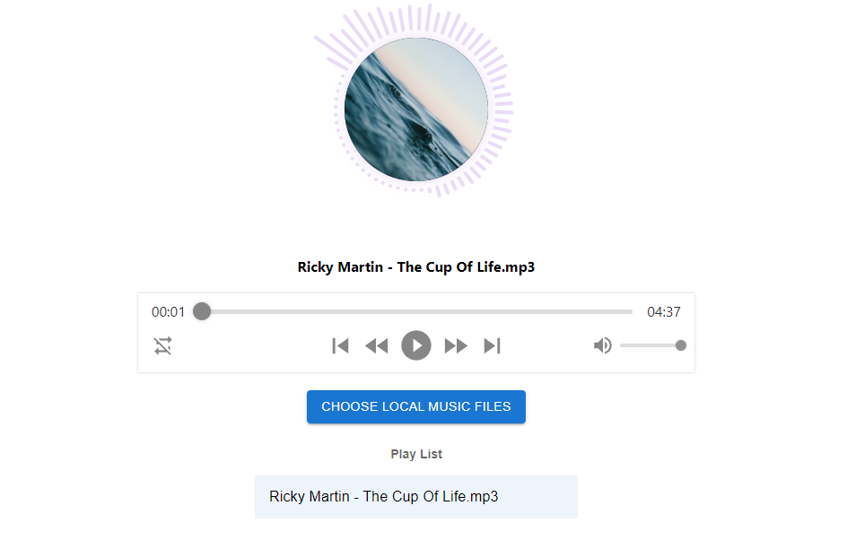
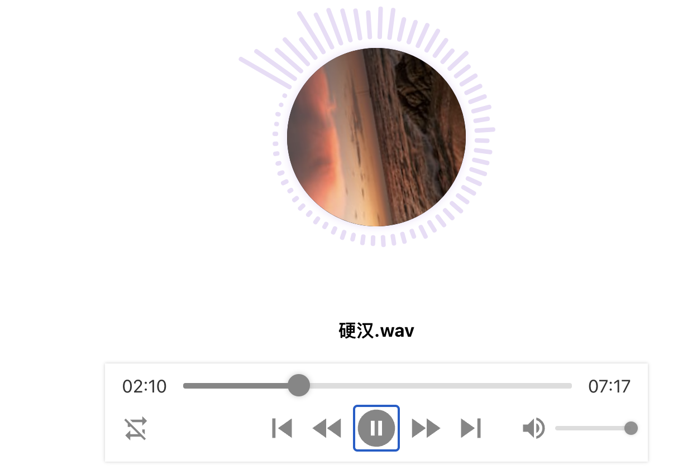
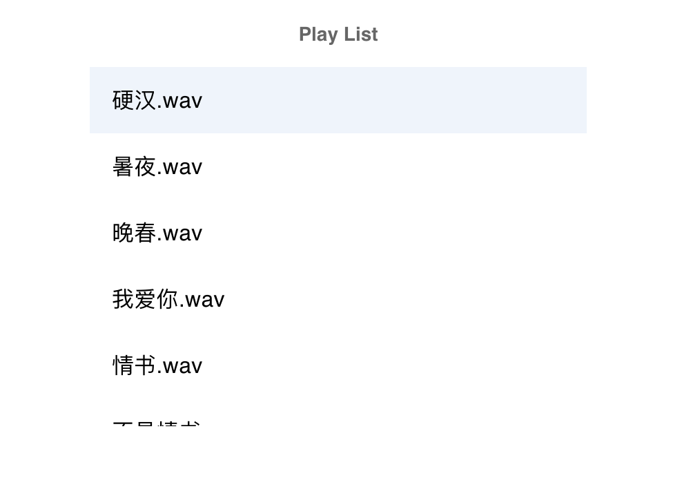

# Web audio player with real-time visualization
The project is Web audio player with real-time visualization. We mainly used Javascript and front-end framework React to implement an music player web application which can read and play local audio file. It can also visualize the real-time frequency data in an art-of-state form during the playing. 

In addition, G graphics renderer produced by Ali Antvis was also used during the development process, which is an easy to use, efficient, powerful 2D visual rendering engine, providing Canvas, SVG and other rendering methods. As a low-level renderer, it has many commonly used built-in graphics, provides full DOM event simulation and animation implementations, which helped us a lot to realize audio visualization and the construction of player's graphic interface.

It looks like this:




### Using Web audio API to read and process data of audio files

Before implementing the visulization animation of audio data, we need to get the data we need first, there are some Web audio API can be used.

First of all, we need to create an `AudionContext`, the reading of audio and the various processing of it take place in this context. The `AudioContext` interface represents an audio-processing graph built from audio modules linked together, each represented by an `AudioNode`, an audio context controls both the creation of the nodes it contains and the execution of the audio processing.

After create a context, we associate an audio player to it as input, then we use `createAnalyser()` to create an analyser node which followed by an gain node, in the analyser node, it will do fft to get the frequency data of audio and put it into an `Uint8Array`, then transfer the data to component of our application, so we can do visulization in our component.We create a `MusicContext` class and encapsulate the above operations into this class, so we can initial and use it more easily.

Create each node of the context, setting the parameters for fft and create and initialize the container of frequency data in the constructor of the `MusicContext` class.

```javascript
class MusicContext {
  constructor(options) {
    this.audioContext = audioContext;
    this.gainNode = audioContext.createGain();
    this.gainNode.connect(audioContext.destination);

    this.analyser = audioContext.createAnalyser();
    this.analyser.connect(this.gainNode);

    this.size = 128;
    if (options && options.size) {
      this.size = options.size;
    }

    this.analyser.fftSize = this.size * 2;

    if (options && options.audioElement) {
      this.source = audioContext.createMediaElementSource(options.audioElement);
      this.source.connect(this.analyser);
    }

    this.data = new Uint8Array(this.analyser.frequencyBinCount);
    this.resumeAudioContext();
  }
  
  resumeAudioContext() {
    if (audioContext) {
      const resumeAudio = () => {
        if (audioContext.state === 'suspended') { audioContext.resume(); }
        document.removeEventListener('click', resumeAudio);
      }
      document.addEventListener('click', resumeAudio);
    }
  }
  ...
}
```

There are 3 methods of the class : The `destroy` is used to destroy the context, disconnect each node; The `setAudioElemnt` is used to associate an audio source to the context as input; The `getFrequencyData` is used to get the real-time frequency domain data of source audio and put it into an array, then return it back.

```javascript
class MusicContext {
  ...
  
  destroy() {
    this.analyser.disconnect(this.gainNode);
    this.source.disconnect(this.analyser);
    this.gainNode.disconnect(this.audioContext.destination);
  }

  setAudioElement(audioElement) {
    if (this.source) {
      this.source.disconnect(this.analyser);
    }
    this.source = this.audioContext.createMediaElementSource(audioElement);
    this.source.connect(this.analyser);
  }

  getFrequencyData() {
    this.analyser.getByteFrequencyData(this.data);
    return this.data;
  }

	...
}
```


### Player component

The Player component is the uppermost component of our web application, each part we saw in the first picture is part of the Player componet, which means they are sub-components.


We can clearly see each part(component) of our project, all of them are part of Player component, the concrete implementation of each part is implemented in its own component, not in the Player component.

```javascript
render() {
  return (
    <div>
      <main className={style.page}>
        <div className={style.exampleWrapper}>
          <Line
            isPlaying={this.state.isPlaying}
            data={this.state.audioData} />
        </div>
        <div className={style.operationWrapper}>
          <div style={{padding: "10px 0"}}>
            <strong>{this.state.audioNameList[this.state.urlIndex]}</strong>
          </div>
        </div>
        <div className={style.audioWrapper}>
          <AudioPlayer
            showSkipControls
            style={{ margin: "auto", width: "33%" }}
            onPlay={this.play}
            onPause={this.pause}
            onEnded={this.end}
            onClickNext={this.next}
            onClickPrevious={this.prev}
            ref={this.audio}
            src={this.state.audioUrlList[this.state.urlIndex]}
            crossOrigin="anonymous" />
        </div>
        <div className={style.operationWrapper}>
          <Button
            variant="contained"
            color="primary"
            style={{ margin: "10px" }}
            onClick={this.chooseLocalMusic}>
              Choose local music files
          </Button>
          <UrlList
            nameList={this.state.audioNameList}
            onClick={this.handleChooseUrl}
            selected={this.state.urlIndex} />
          <input
            type="file"
            style={{ display: 'none' }}
            ref={this.hiddenFileInput}
            onChange={this.handleFileChange}
            multiple />
        </div>
      </main>
    </div>
  );
}
```

In this component, as mentioned before, we need to create an context to process audio, so we create a MusicContext object and in the `componentDidMount` lifecycle function, which will execute  after the component is generated and mounted to the DOM, we call the `setAudioElement` method to associate the audio player to it as input. We alse create and initialize refs and states for the component, by controlling these states in different methods of component to achieve interaction between user and application.

```javascript
// create a context
export const MusicVisualizerContext = new MusicContext();
// Player commponent
export default class Player extends React.Component {
  componentDidMount() {
    MusicVisualizerContext.setAudioElement(this.audio.current.audio.current); // associate audio as the source of context
  }

  constructor() {
    super()
    // refs
    this.audio = createRef()
    this.hiddenFileInput = createRef()
    this.lastTime = 0
    this.raf = 0
    this.state = {
      urlIndex: 0,
      audioData: [],
      isPlaying: false,
      audioUrlList: [],
      audioNameList: []
    }
  }
  
  ...
}
```

The `step` method is a key method. After the music plays, it will be the callback fuction of the `requestAnimationFrame` function, so it will keep executing again and again, in the `step` function, which will get the frequency data of each frame in real-time then transfer it to the Line component to render it in an art-of-state form. Other method is the click event callback function of buttons in the control pad of audio, used to control the play.

```javascript
step = (timestamp) => {
  if (!this.lastTime) this.lastTime = timestamp
  const progress = timestamp - this.lastTime
  if (progress === 0 || progress > 0) {
    this.setState({ audioData: [...MusicVisualizerContext.getFrequencyData()] }) //transfer frequency data
    this.lastTime = timestamp
  }
  this.raf = requestAnimationFrame(this.step)
}

play = () => {
  this.setState({ isPlaying: true }) //change playing states
  this.raf = requestAnimationFrame(this.step)
}

next = () => {
  this.setState({ urlIndex: (this.state.urlIndex + 1) % this.state.audioUrlList.length })
}

prev = () => {
  this.setState({ urlIndex: (this.state.urlIndex - 1 + this.state.audioUrlList.length) % this.state.audioUrlList.length })
}

pause = () => {
  this.setState({ isPlaying: false }) //change playing states
  this.raf && cancelAnimationFrame(this.raf)
}

end = () => {
  if (this.state.urlIndex === this.state.audioUrlList.length - 1) {
    this.pause()
  } else {
    this.next()
  }
}
```


### Create a rotating circle image

In our player, we want a circle image keep rotating during the music plays, which just like other popular music application, there's a spinning music cover. So we write a function named `getImageCircle`, so we just need to call this function in Line component to create such thing.


We use APIs provided by G graphics renderer to implement it. The g-canvas to draw, the coordinate of center of the circle, radius and the shadowcolor will be the parameter of the function. In this function, we first call the addShape method to draw a circle, then we also add an image on it, the start point of the image should be the upper-left corner so it should be (x-r,y-r), (x,r) is the circle center's coordinate.However, we want a circle image instead of a square image, so we call the setClip method provided by G to clip the image to circle shape, just same as the circle we draw before.

```javascript
export default function getImageCircle(canvas, x, y, r, shadowColor) {
  ...

  const shape = canvas.addShape('image', {
    attrs: {
      x: x - r,
      y: y - r,
      width: 2 * r,
      height: 2 * r,
      img: `https://source.unsplash.com/random/${2 * r}x${2 * r}?Nature`
    }
  })

  shape.setClip({
    type: 'circle',
    attrs: {
      x,
      y,
      r
    }
  })
  ...
  
}
```

The next step is to find a way to make the image rotating. Rotation animation cannot be simulated by basic attributes directly. Matrix transformation is used here.We call `animate` method to  add animation for the shapm then `shape.getMatrix()` is used to obtain the initial matrix, and then the matrix corresponding to each ratio is calculated by `transform`.

`Transform` is an extended matrix transform method provided by G that takes two arguments, the first being the current matrix and the second being the Action array. The corresponding action for the rotation here is:

```javascript
[
  ['t', -x, -y],
  ['r', angle of rotation],
  ['t', x, y]
]
```

```javascript
shape.animate((ratio) => {
  return {
    matrix: transform(matrix, [
      ['t', -x, -y],
      ['r', radian * ratio],
      ['t', x, y],
    ])
  }
}, {
  duration: 10000,
  repeat: true
})
```


### Real-time spectrogram

Here comes the most import section of our project, displaying the real-time frequency data. We used the height of rectangule to represent the frequency data. Around the image circle, there are 64 rectangules. We abstract the function into a component named `Line`.

In order to update the height of rectangle according to the frequency data, these rectangles should be stored in an array as an attribute of the component. Therefore, when the component was mounted, the array should be initialized. Here is the code:

```JavaScript 
this.lineArray = Array.from({ length: PONINT_NUM }, (v, i) => {
  const degree = (360 / PONINT_NUM) * i - 150;
  const l = Math.cos((degree * Math.PI) / 180);
  const t = Math.sin((degree * Math.PI) / 180);
  const r = R + OFFSET;

  return this.canvas.addShape("rect", {
    attrs: {
      width: RECT_WIDTH,
      height: RECT_WIDTH,
      radius: RECT_WIDTH / 2,
      x: X + l * r - RECT_WIDTH / 2,
      y: Y + t * r - RECT_WIDTH / 2,
      fill: RECT_COLOR,
    },
  }).rotateAtPoint(X + l * r, Y + t * r, (degree - 90) * Math.PI / 180);
});
```

The most important part of this code is how to calculate the position of every rectangle. In the code, the `x` and `y` of object `attrs` represent the center of a rectangle. We can use Trigonometric functions to calculate the value of `x` and `y`.
$$
x = X + r \cos(\frac{degree}{180}\pi) - \frac{RECT\_WIDTH}{2} \\
y = Y + r \sin(\frac{degree}{180}\pi) - \frac{RECT\_WIDTH}{2}
$$
The `X` and `Y` represent the position of circle center. The `r` is equal to the radius of circle plus the gap between circle and rectangles. While playing the music, the `Player` component called `setState` to update the frequency data and passed the data to the `Line` component. The `setState` would cause the re-rendering of `Player`. As the child component of `Player`, `Line` will re-render following `Player`. In order to display the real-time spectrogram, we should update the height of rectangles in the life cycle function `componentDidUpdate`.

```javascript
componentDidUpdate(prevProps, prevState) {
  if (this.props.data && this.props.data.length > 0 && this.props.data !== prevProps.data) {
    const data = this.filterArray(this.props.data);
    data.map((item, index) => {
      this.lineArray[index].attr("height", item * item / 65025 * 50 + RECT_WIDTH);
    });
  }
  ...
}
```

The `componentDidUpdate` will be called after `render` method of `Line` during re-redendering. Here is the demo while playing music.




### Play list

In the last part of the report, we are going to introduce the play list component called `UrlList`. We used the `List` and `ListSubheader` of `Material UI` to implement the play list. Play-list is the basic function of regular music player. Besides displaying the music files, users can also choose any music file to play by clicking the file name. However, the music files was stored in the `Player` component, and the `UrlList` just stored the filenames. Therefore, we must pass the filename from `List` to `Player`. It is a little difficult to transit data from child compoent to parent component directly. Here is our solution which is passing the method bound with parent component to child compoent.

```javascript
// Parent
handleChooseUrl = (index) => {
  this.setState({ urlIndex: index })
}
<UrlList 
	nameList={this.state.audioNameList} onClick={this.handleChooseUrl} selected={this.state.urlIndex} />
    

// Child
class UrlList extends Component {
  handleClick = (e) => {
    this.props.onClick(e.currentTarget.id);
  };

  render() {
    return (
      <div style={{ margin: "auto", width: "100%", maxWidth: 360, bgcolor: "background.paper" }}>
        <List
          sx={{ width: "100%", maxWidth: 360, bgcolor: "background.paper", position: "relative", overflow: "auto", maxHeight: 300 }}
          subheader={<ListSubheader><span><strong>Play List</strong></span></ListSubheader>}
        >
          {this.props.nameList.map((name, index) => (
            <ListItemButton
              key={index}
              id={index}
              onClick={this.handleClick}
              selected={this.props.selected === index}
            >
              <ListItemText primary={name} />
            </ListItemButton>
          ))}
        </List>
      </div>
    )
  }
}
```

In child component, every music file names in the play list is a button. When click the button, the child component will call the method passed by parent to transit the index to parent componet. In parent compoent, the call back function called `setState` to update the music file to be played. Here is the static demo of play list


